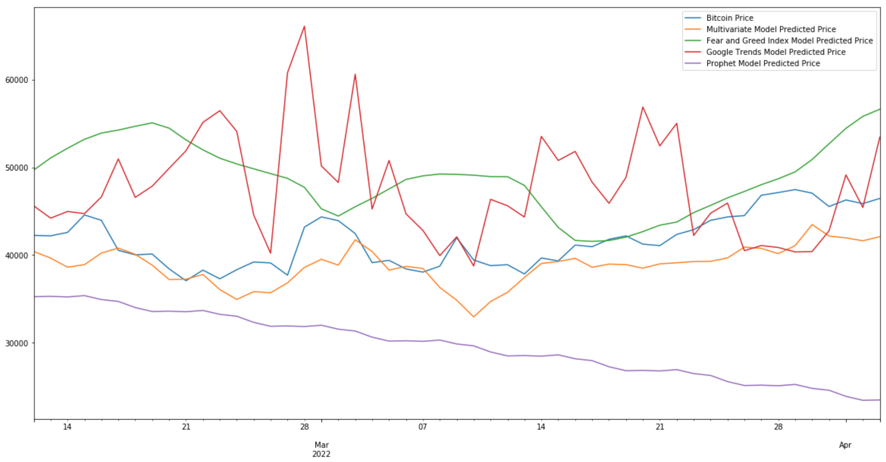
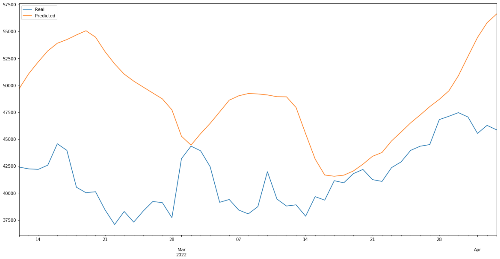
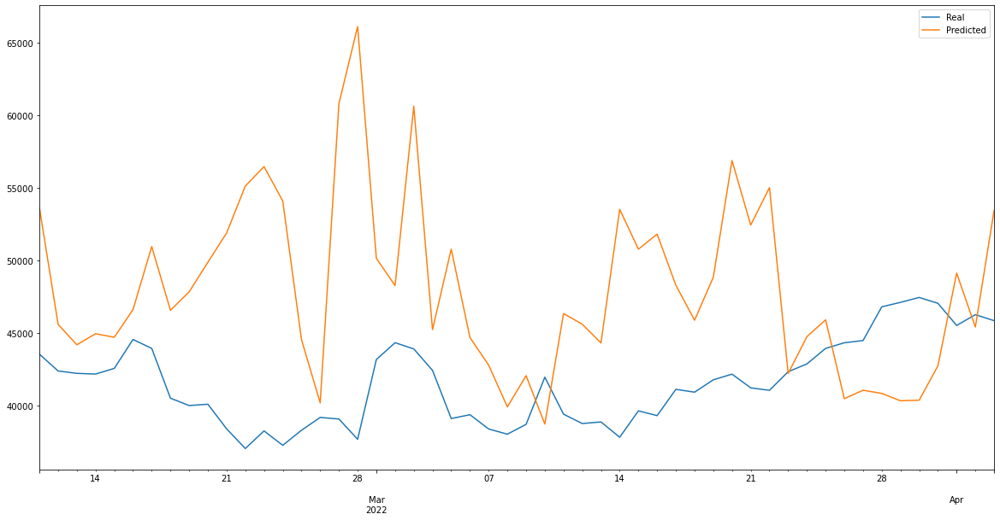
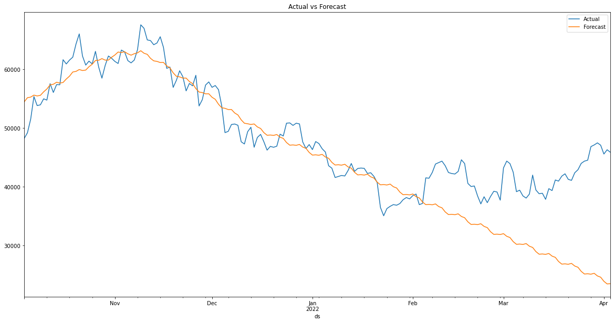
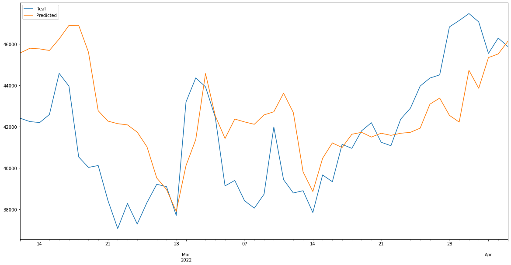
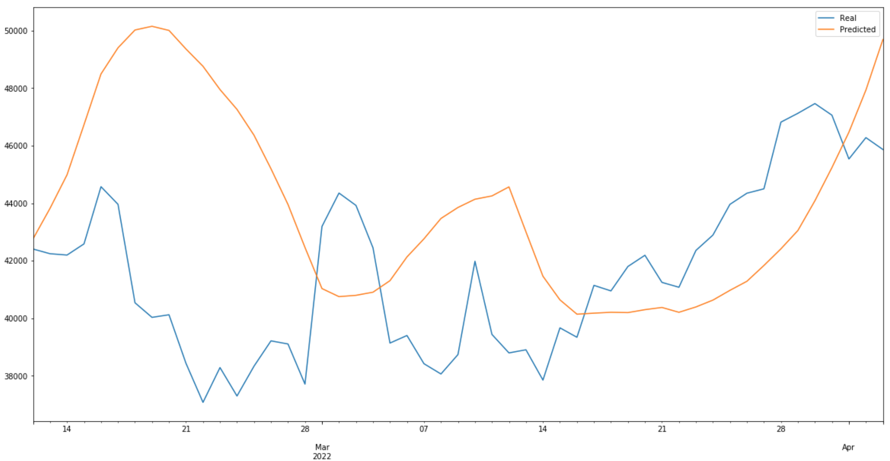
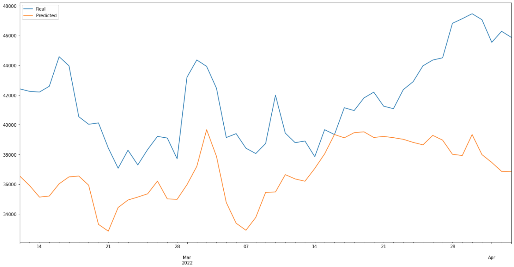
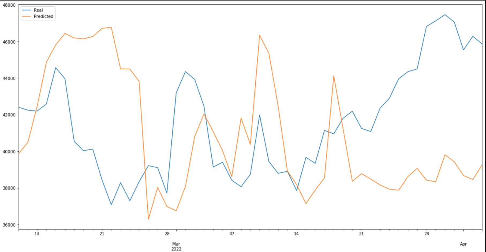
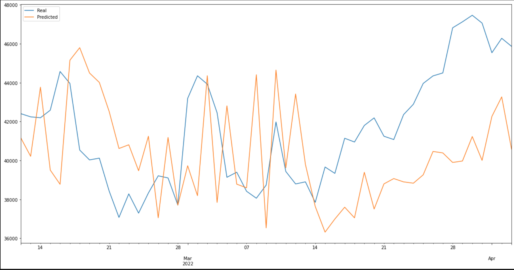

# Findings Summary

## Regarding multivariate models, which indicators will best predict Bitcoin's price?

The Fear and Greed Index was the best predictor of Bitcoin price because it's made up of a variety of components. The Fear and Greed Index includes Bitcoin's dominance in the overall market, market momentum/volume, social media, Google Trends, and volatility. Thus, because the crypto Fear and Greed Index already includes Google Trends as an input along with a variety of others, it's clear that the Fear and Greed Index is a more well-rounded input. The Fear and Greed Index single-feature model also performed better than its Google Trends counterpart based on the charts we created.

### Overlay all charts

### FNG 300 Epoch Model

### Google Trends 300 Epoch Model

## How do the models compare to one another?

The models were similar to each other in some ways but different in others. For example, the Prophet model was relatively close to predicting the general direction of Bitcoin price, but then it diverged at the end by continuing downward while Bitcoin picked up. The other models were much closer to predicting Bitcoin price movement, but the single-feature models often lagged further behind the multivariate model and were less accurate, meaning the multivariate model was the best model.

### Prophet Model

### Multivariate 300 Epoch Model

### FNG 300 Epoch Model

### Google Trends 300 Epoch Model

## What else did we learn?
We learned that 300 epochs was a good number to use for our models and found that less was likely not enough data while more resulted in over-fitting the model. We also learned that, to create a Keras model with more than 2 dimensions, we needed to reshape the data to be 2 dimensions and make the features for the model a range (for example: feature_range = range(0,3)).

### FNG 10 Epoch Model

### FNG 100 Epoch Model

### FNG 300 Epoch Model

### FNG 500 Epoch Model

### FNG 1000 Epoch Model
